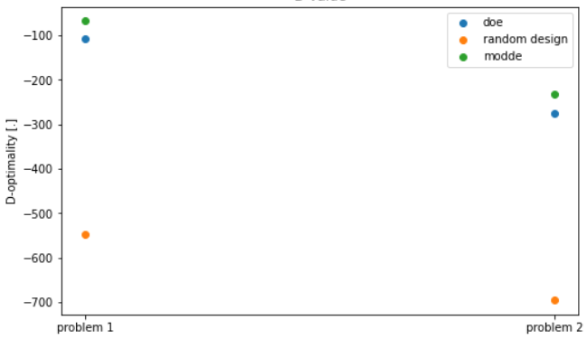

# Performance compared to modde

The purpose of this package is enable the user to find D-optimal designs in the most general setting. doe can be used for larger models (e.g. [this example](large_mixture.md)) with more general constraints like NChooseK constraints (see [here](nchoosek_constraint.md)) or multiple mixture constraints (see [here](multiple_mixture_constraints.md)). Unfortunately, the performance is decreased compared to modde in cases where modde can actually find a design.

To see this, one can determine models for the following problems using doe.

### Problem 1
```python 
problem = opti.Problem(
    inputs=[opti.Continuous(f"x{i+1}", [0, 1]) for i in range(12)]
    + [opti.Continuous(f"p{i+1}", [-1, 1]) for i in range(3)],
    outputs=[opti.Continuous("y")],
    constraints=[opti.LinearEquality(names=[f"x{i+1}" for i in range(12)], rhs=1)],
)
```

### Problem 2
```python
problem = opti.Problem(
    inputs=[opti.Continuous(f"x{i+1}", [0, 1]) for i in range(12)]
    + [opti.Continuous(f"p{i+1}", [-1, 1]) for i in range(3)],
    outputs=[opti.Continuous("y")],
    constraints=[
        opti.LinearEquality(names=[f"x{i+1}" for i in range(12)], rhs=1),
        opti.LinearInequality(names=["x1", "x2", "x3"], rhs=0.7),
        opti.LinearInequality(names=["x1", "x2", "x3"], lhs=-1, rhs=-0.3),
        opti.LinearInequality(names=["x10", "x11", "x12"], rhs=0.8),
        opti.LinearInequality(names=["x10", "x11", "x12"], lhs=-1, rhs=-0.2),
        opti.LinearInequality(names=["x5", "x6"], lhs=[-1, 0.5], rhs=0),
        opti.LinearInequality(names=["x5", "x6"], lhs=[-1, 2], rhs=0),
    ],
)
```

The diagram below shows the D optimality for the modde result, the doe result and a random design (as a reference).

